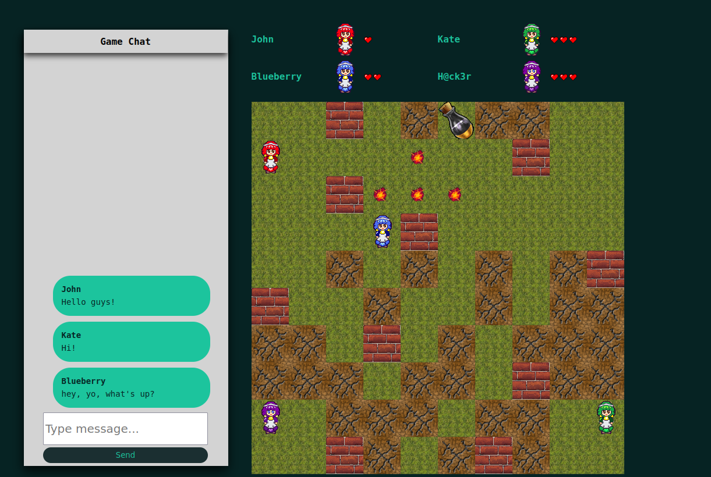

# Bomerman DOM

   

**Bomberman DOM** is one of the largest team projects in kood/Jõhvi. The project combines a combination of different solutions. One of the unique features is the embedded framework, which was created by hand in one of the previous course assignments. This project was a unique experience of real teamwork. We distributed joint and individual tasks, held session meetings for discussions and regularly called each other to solve difficult moments.

<p align="center">
  
</p>

This is an interactive multiplayer Bomberman game developed using a custom DOM framework. The game allows 2 to 4 players to battle against each other until only one survives. In addition to the classic Bomberman gameplay, the project includes a chat feature using WebSockets for players to communicate during the game.

My key tasks included creating the game lobby using server requests and client-side java script processing. Constructed server models for game elements. Integrated and implemented a web socket to support the chat. And also participated in the development of game logic.

## Video

Here you can watch full video of the project:

[Bomberman DOM](https://youtu.be/zIlhnhduHTc)


## Table of Contents

- [Features](#features)
- [Game Mechanics](#game-mechanics)
- [Installation](#installation)
  - [Manual](#manual)
  - [Docker](#docker) 
- [Used technologies](#used-technologies)

## Features

- **Multiplayer Bomberman Game:** Enjoy the classic Bomberman gameplay with 2 to 4 players battling to be the last one standing.
- **Dynamic Map:** The map features destructible blocks, undestroyable walls, and randomly generated power-ups.
- **Power-ups:** Collect power-ups to enhance your abilities, including extra bombs, increased explosion range, and faster movement.
- **Player Lives:** Each player starts with 3 lives. Once all lives are depleted, the player is out of the game.
- **WebSockets Chat:** Communicate with other players in real-time through the in-game chat powered by WebSockets.

## Game Mechanics

### Players

- **Number of Players:** 2 - 4
- **Lives:** Each player starts with 3 lives.

### Map

- **Starting Positions:** Players start in different corners of the map.
- **Block Types:** Destructible blocks and undestroyable walls. Walls remain fixed, while blocks are randomly generated.
- **Survivability:** Players must have space to avoid bomb explosions in their starting positions.

### Movement
- Player can move up, down, left and right using Arrow Keys
- Player can place a bomb by pressing CTRL

### Power-ups

- **Bombs:** Increase the number of bombs dropped at a time by 1.
- **Flames:** Increase explosion range from the bomb in four directions by 1 block.
- **Speed:** Increase movement speed.

## Installation

### Manual

To run this bomberman-dom project manually, follow these steps:

1. Ensure you have Golang installed on your machine.
   ```bash
   go version
   ```
   If not, then check the docs: [Golang Install](https://go.dev/doc/install)
   
2. Clone this repository to your local machine.
   ```bash
   git clone https://github.com/Okarine/bomberman-dom.git && cd bomberman-dom
   ```

3. Compile backend.
   ```bash
   make
   ```

4. Run backend.
   ```bash
   ./bomberman-dom
   ```

5. Open the project in Web-Browser: http://localhost:8080

### Docker

To run this bomberman-dom project in docker, follow these steps:

1. Ensure you have Docker installed on your machine.
   ```bash
   docker version
   ```
   If not, then check the docs: [Docker Install](https://docs.docker.com/engine/install/)
   
2. Clone this repository to your local machine.
   ```bash
   git clone https://01.kood.tech/git/Avengerist/bomberman-dom.git && cd bomberman-dom
   ```

3. Start docker script
    ```bash
    bash docker.sh
    ```

4. Open the project in Web-Browser: <br>http://localhost:8080


## Used technologies 

- **Backend:** Golang language 
- **Frontend:** JavaScript, custom DOM framework 
- **Others:** Gorilla websocket, Docker, Jira